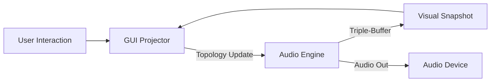

# DirtyRack Architecture

DirtyRack は、決定論的なオーディオ計算と、非同期な視覚的投影を両立するためのマルチレイヤー・アーキテクチャを採用しています。

## 1. SIMD-Poly DSP Engine (`dirtyrack-modules`)

システムの心臓部であり、すべての音響演算を司ります。

- **16-Channel Massive Polyphony**: VCV Rack 互換の 16 チャンネル・多重化ケーブルをネイティブサポート。SIMD (`wide::f32x4`) 4 つ分、あるいは AVX-512 等の最適化により、高密度のポリフォニック演算を並列実行します。
- **No-Alloc Process Loop**: オーディオコールバック内でのメモリ確保を完全に排除。すべてのバッファは初期化時に確保されます。
- **Deterministic Math**: プラットフォーム間の差異を排除するため、すべての数学関数は `libm` によるソフトウェア実装、または決定論的な多項式近似を使用します。

## 2. The Graphical Projector & Observation Layer (`dirtyrack-gui`)

GUI はオーディオエンジンの「影」を映し出すプロジェクター、および内部を解剖する「顕微鏡」として機能します。

- **Triple-Buffer Sync**: `triple_buffer` クレートを使用。オーディオスレッドは最新の視覚状態（LEDレベル、波形）に加え、`ForensicData`（鑑識データ）を書き込みます。
- **Forensic Observation**: 各ノードの熱状態やドリフト、個体差を非同期に監視。オーディオのリアルタイム性を損なうことなく、内部の深淵を可視化します。
- **Lock-Free Topology Updates**: パッチの変更は `crossbeam-channel` を通じてオーディオスレッドへ送られ、次のサンプルの直前に適用されます。

## 3. Plugin Host Integration (`dirtyrack-plugin`)

`nih-plug` フレームワークを介して、DirtyRack コアを DAW 互換のプラグインとして包み込みます。

- **VST3 / CLAP Support**: DAW からの MIDI ノートやポリフォニック・モジュレーションを、`MidiCvModule` を通じて内部の 16ch 信号へとマッピングします。
- **Headless Mode**: GUI を持たない CLI モードや、DAW 内でのバックグラウンドレンダリングにおいても、同一の決定論的エンジンが動作します。

## 3. The Shared SDK (`dirtyrack-sdk`)

内蔵モジュールとサードパーティ・モジュールの境界を消失させるための基盤です。

- **Stable C-ABI**: 動的にロードされる外部モジュールに対して、安定した関数呼び出しインターフェースを提供します。
- **Common Traits**: `RackDspNode` トレイトにより、サードパーティ製モジュールも内蔵モジュールと全く同じ優先度と精度で実行されます。

## 4. State Extraction & Preservation

パッチのホットリロード時にも音を止めないための仕組みです。

- **`extract_state()` / `inject_state()`**: モジュールのトポロジーが更新される際、同じ ID を持つ新旧のモジュール間でオシレーターの位相やフィルターの状態を転送します。これにより、パッチを組み替えながら演奏を続けることが可能です。

## 5. DAG-Based Routing

パッチは有向非巡回グラフ（DAG）として管理されます。

- **Topological Sorting**: ケーブルの接続に基づいて、処理順序が自動的に計算されます。
- **Sample-Accurate Modulation**: すべての CV およびオーディオ信号はサンプル単位の精度で伝搬されます。

---

## データフロー

