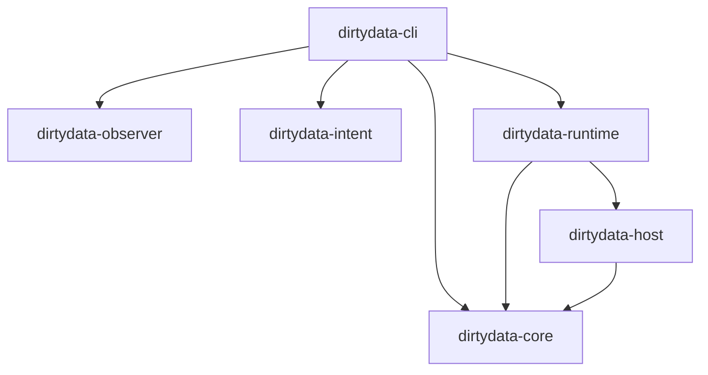

# DirtyData Architecture

DirtyData の内部構造（Architecture）に関する技術的リファレンスです。
システムは複数のクレート（層）に分割され、それぞれが厳格な役割と境界を持っています。

## 1. Canonical IR (Machine Truth)

`dirtydata-core` クレートで定義されている、システムの唯一の真実（Source of Truth）です。

- **`Graph`**: プロジェクト全体の構造を保持します。すべての `Node` と `Edge`、そして適用された `PatchId` の履歴を持ちます。
- **`Node`**: オーディオソース（`Source`）、エフェクト（`Processor`）、外部プラグイン（`Foreign`）などの構成要素です。
- **`Edge`**: ノード間の接続（ルーティング）です。
- **`ConfigSnapshot`**: ノードのパラメーター（ゲイン値など）。決定論的な順序を保証するため `BTreeMap` が使用されています。

GUI やユーザーが IR を直接書き換えることは**禁止**されています。すべての状態変化は `Patch` を通じて適用されなければなりません。

## 2. Timeline / Branching System

DirtyData は、Git にインスパイアされたブランチ管理システムを持っています。

- 物理的なオーディオファイルやセッションファイルを複製することなく、IR のポインタ（HEAD と refs）のみを切り替えることで超高速な「パラレルワールドの移動」を実現します。
- `Storage` は `.dirtydata/refs/heads/` と `.dirtydata/HEAD` を管理し、各ブランチがどの `PatchId` の系統（Ancestry）に属しているかを追跡します。

## 3. Playable Runtime (cpal + arc-swap)

`dirtydata-runtime` クレートは、IR グラフを実際に「音の出る状態」へ変換します。

- **`cpal`**: OS のオーディオデバイスと直接通信し、リアルタイムのコールバックスレッドを起動します。
- **`arc-swap`**: ロックフリーのダブルバッファリングを実現します。ユーザーが `dirtydata patch apply` で新しいエフェクトを追加した際、オーディオコールバックを一度もブロックすることなく（= 音切れなしに）、安全に新しい DSP グラフのポインタへアトミックに切り替えます。

## 4. Plugin Sandbox (IPC Boundary)

`dirtydata-host` は、VST などの不安定なサードパーティ製プラグインからコアシステムを保護します。

- プラグインは `dirtydata-plugin-worker` という**独立した子プロセス**として起動します。
- `stdin` / `stdout` 越しの RPC 通信によってオーディオバッファの受け渡しを行います。
- サンドボックスは、子プロセスが `NaN` を返した（NaN Storm）り、プロセスがクラッシュ（Segfault）したことを瞬時に検知し、出力を安全な **Frozen Asset（現在は無音のバッファ）へフォールバック** させます。
- この境界により、プラグインがどれほど暴走しても、ホストである DirtyData 自体がパニックを起こすことはありません。

## 5. Observer Daemon

`dirtydata-observer` および CLI の `daemon` サブコマンドは、システムと「外部世界（ファイルシステムなど）」とのズレを監視します。

- **Observe before Control**: システムの状態を変更する前に、外部オーディオファイル（WAV 等）の BLAKE3 ハッシュやタイムスタンプを再計算します。
- **Hot-Reloading**: `.dirtydata/ir/current.json` の変更を `notify` クレートでリアルタイムに検知し、オーディオエンジンのグラフを自動更新します。
- 外部ファイルが手動で書き換えられた場合、即座にそれを検知し、Confidence Score（信頼性スコア）を `Suspicious` に落として警告を出します。

## クレートの依存関係

