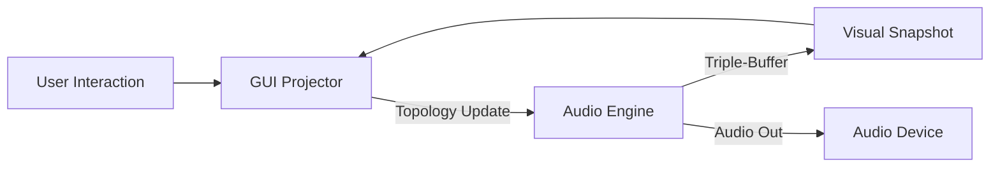

# DirtyRack Architecture

DirtyRack employs a multi-layered architecture designed to balance deterministic audio computation with asynchronous visual projection.

## 1. Gehenna Engine: Parallel Deterministic DSP (`dirtyrack-modules`)

The second-generation engine, responsible for all acoustic operations with bit-perfect reproducibility.

- **16-Channel SIMD Polyphony**: Native support for VCV Rack-compatible 16-channel multiplexed cables. High-density polyphonic operations are executed in parallel using SIMD (`wide::f32x4` x4).
- **Deterministic Voice Drift**: A specialized drift engine simulates analog instability (1/f noise) deterministically. The same seed produces the exact same "analog personality" across all instances.
- **No-Alloc Process Loop**: Completely eliminates memory allocation within the audio callback. Uses pre-allocated topological buffers.

## 2. Forensic Observation & MRI Layer (`dirtyrack-gui`)

The GUI acts as a "Medical Projector" for dissecting the signal chain.

- **Triple-Buffer Visual Projection**: The engine writes `VisualSnapshot` data including peak levels, clipping counts, DC offsets, and energy density.
- **Patch MRI Overlay**: Signal pathologies are projected directly onto module faceplates (Clipping Glow, Heatmaps, Aura).
- **Explain Why Engine**: A diagnostic system that correlates engine statistics to human-readable reports, identifying issues like feedback runaway or denormal storms.
- **Provenance Timeline**: Records every committed parameter change and state snapshot into a `CausalityLog` for auditing.

## 3. Plugin Host Integration (`dirtyrack-plugin`)

Wraps the DirtyRack core into a DAW-compatible plugin via the `nih-plug` framework.

- **VST3 / CLAP Support**: Maps MIDI notes and polyphonic modulations from the DAW into internal 16ch signals through the `MidiCvModule`.
- **Headless Mode**: The same deterministic engine operates in GUI-less CLI mode or during background rendering within a DAW.

## 4. The Shared SDK (`dirtyrack-sdk`)

The foundation for blurring the boundary between built-in and third-party modules.

- **Stable C-ABI**: Provides a stable function call interface for dynamically loaded external modules.
- **Common Traits**: Through the `RackDspNode` trait, third-party modules are executed with the exact same priority and precision as built-in ones.

## 5. State Extraction & Preservation

A mechanism to ensure sound does not stop even during a hot-reload of a patch.

- **`extract_state()` / `inject_state()`**: When the module topology is updated, oscillator phases and filter states are transferred between old and new modules sharing the same ID. This allows for continuous performance while reconfiguring the patch.

## 6. DAG-Based Routing

Patches are managed as Directed Acyclic Graphs (DAGs).

- **Topological Sorting**: The processing order is automatically calculated based on cable connections.
- **Sample-Accurate Modulation**: All CV and audio signals are propagated with sample-level precision.
- **Feedback Compensation**: Deterministically manages delays in feedback loops.

## 7. Deterministic Auditing & Intent Layer (`dirtydata-*`)

A meta-layer that manages the "causality" behind audio reality.

- **`dirtydata-observer`**: Monitors deterministic breaks (Divergence) at the sampling level and generates a `DivergenceMap`.
- **`dirtydata-intent`**: Structures user actions as "Intents." Tracks "who changed specific sounds and for what purpose" (Attribution).
- **`dirtydata-runtime`**: Executes ultra-high-speed comparison rendering offline to scientifically extract minute differences between two branches.

---

## Data Flow

