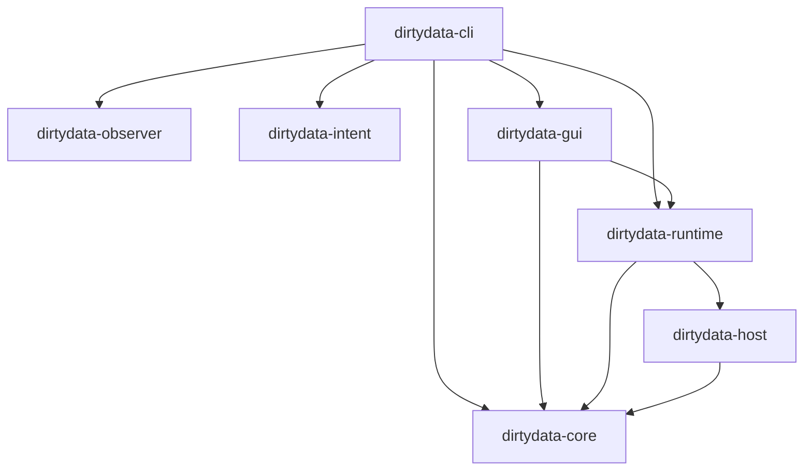

# DirtyData Architecture

DirtyData の内部構造（Architecture）に関する技術的リファレンスです。
システムは複数のクレート（層）に分割され、それぞれが厳格な役割と境界を持っています。

## 1. Canonical IR (Machine Truth)

`dirtydata-core` クレートで定義されている、システムの唯一の真実（Source of Truth）です。

- **`Graph`**: プロジェクト全体の構造を保持します。すべての `Node` と `Edge`、そして適用された `PatchId` の履歴を持ちます。
- **`Node`**: オーディオソース（`Source`）、エフェクト（`Processor`）、外部プラグイン（`Foreign`）などの構成要素です。
- **`Edge`**: ノード間の接続（ルーティング）です。
- **`ConfigSnapshot`**: ノードのパラメーター（ゲイン値など）。決定論的な順序を保証するため `BTreeMap` が使用されています。

GUI やユーザーが IR を直接書き換えることは**禁止**されています。すべての状態変化は `Patch` を通じて適用されなければなりません。

## 2. Timeline / Branching System

DirtyData は、Git にインスパイアされたブランチ管理システムを持っています。

- 物理的なオーディオファイルやセッションファイルを複製することなく、IR のポインタ（HEAD と refs）のみを切り替えることで超高速な「パラレルワールドの移動」を実現します。
- `Storage` は `.dirtydata/refs/heads/` と `.dirtydata/HEAD` を管理し、各ブランチがどの `PatchId` の系統（Ancestry）に属しているかを追跡します。

## 3. Playable Runtime (cpal + arc-swap)

`dirtydata-runtime` クレートは、IR グラフを実際に「音の出る状態」へ変換します。

- **`cpal`**: OS のオーディオデバイスと直接通信し、リアルタイムのコールバックスレッドを起動します。
- **`arc-swap`**: ロックフリーのダブルバッファリングを実現します。ユーザーが `dirtydata patch apply` で新しいエフェクトを追加した際、オーディオコールバックを一度もブロックすることなく（= 音切れなしに）、安全に新しい DSP グラフのポインタへアトミックに切り替えます。

## 4. Plugin Sandbox (IPC Boundary)

`dirtydata-host` は、VST などの不安定なサードパーティ製プラグインからコアシステムを保護します。

- プラグインは `dirtydata-plugin-worker` という**独立した子プロセス**として起動します。
- `stdin` / `stdout` 越しの RPC 通信によってオーディオバッファの受け渡しを行います。
- サンドボックスは、子プロセスが `NaN` を返した（NaN Storm）り、プロセスがクラッシュ（Segfault）したことを瞬時に検知し、出力を安全な **Frozen Asset（現在は無音のバッファ）へフォールバック** させます。
- この境界により、プラグインがどれほど暴走しても、ホストである DirtyData 自体がパニックを起こすことはありません。

## 5. Observer Daemon

`dirtydata-observer` および CLI の `daemon` サブコマンドは、システムと「外部世界（ファイルシステムなど）」とのズレを監視します。

- **Observe before Control**: システムの状態を変更する前に、外部オーディオファイル（WAV 等）の BLAKE3 ハッシュやタイムスタンプを再計算します。
- **Hot-Reloading**: `.dirtydata/ir/current.json` の変更を `notify` クレートでリアルタイムに検知し、オーディオエンジンのグラフを自動更新します。
- 外部ファイルが手動で書き換えられた場合、即座にそれを検知し、Confidence Score（信頼性スコア）を `Suspicious` に落として警告を出します。

## 6. Graphical Projector (GUI as Projection)

`dirtydata-gui` クレートは、システムの真実を視覚化し、ユーザーからの干渉を仲介します。

- **Silent Projector (Read-Only Projection)**: `ArcSwap<Graph>` と `notify` を組み合わせ、Core の IR (current.json) をリアルタイムに投影。描画負荷がオーディオエンジンをブロックすることはありません。
- **The Surgeon (Interaction Machine)**: 楽観的描画（Optimistic Rendering）により、Core のバリデーション待ちの間も「接続された未来」を黄色い破線で即座に表示。操作の遅延をユーザーから隠蔽します。
- **Cosmetic vs Semantic**: ノードの座標やズーム位置は `ui_layout.json` (Cosmetic State) に保存され、Core の IR には一切影響を与えません。一方、ノード接続は `UserAction` としてパッチ化され、Core の真実へと昇格します。
- **Semantic Projections**: `Intent Zones` による意図のグループ化や、`Confidence Score` に基づくノードの明滅（Glitch エフェクト）により、数値以上の「システムの状態」を伝えます。

## 7. The VoiceStack (Polyphony)

DirtyData は、単音（モノフォニック）の制限を超え、動的なポリフォニーを実現します。

- **`VoiceStackNode`**: 内部にサブグラフを持ち、指定されたボイス数（初期実装は 8 ボイス）だけ DSP ランナーを複製します。
- **Global vs Per-Voice**: 外部（Global）からの信号は全ボイスにブロードキャストされますが、ノートオンなどのコマンドはボイス・アロケーターによって特定のボイス・インスタンスへ振り分けられます。

## 8. The Conductor (Sequencer & CV-Command)

DirtyData のシーケンサーは、単なる MIDI 演奏ではなく「時間軸の決定論的制御」を司ります。

- **CV-Command Protocol**: オーディオ信号の中にコマンドを埋め込むプロトコル。
    - **Left Channel**: コマンドコード（NoteOn/Off 等）。
    - **Right Channel**: ペイロード（ノート番号、ベロシティ等）。
- この「オーディオとしてのコマンド」により、Delay ノードを通せば演奏が正確に遅れ、LFO で揺らせばノートが揺らぐといった、音響信号と演奏情報の境界を失わせる実験が可能です。

## 9. State Preservation (Inception-style Hot-swapping)

グラフのホットスワップ時、オシレーターの位相やエンベロープの状態がリセットされることを防ぎます。

- **`extract_state()` / `inject_state()`**: 新旧のグラフ間で `StableId` が一致するノードに対し、内部の動的な状態（位相、現在のレベル等）を抽出し、新しいインスタンスへ注入します。
- これにより、演奏中であっても音の連続性を保ったまま（Zero-Glitch）、ノード構成やパラメータの「因果」を書き換えることが可能です。

## 10. The Workbench (Shared Visualization)

オーディオエンジン（Audio Thread）と GUI（Main Thread）を繋ぐ高速な監視ブリッジです。

- **Lock-free Shared State**: `DashMap` (Atomic Meters) と SPSC RingBuffer (Oscilloscope) を使用し、GUI がオーディオスレッドの優先度を妨げることなく、リアルタイムな波形とピーク値を覗き見（Projection）することを可能にします。

## クレートの依存関係

